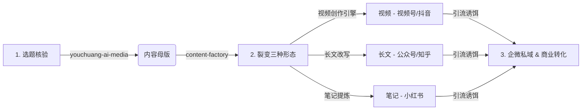

# 优创Hub AI 线上媒体推广中心

> **💡 核心理念**：一套内容，全网占位，重点平台沉淀转化。以“内容母版”为智力核心，通过 AI 自动化与多智能体（Skills）高效裂变为视频、长文、笔记三种形态，最终统一沉淀到企业微信和社群做业务转化。

---

## 📂 目录结构与设计

本文件夹是优创Hub线上媒体推广的“AI原生内容工坊”，各子目录设计如下：

*   **`内容母版/`**：内容的“智力锚点”与“数据底座”。存放由 AI 粗筛、人工确认、多方核查后的核心选题与深度观点（`master_content.md`），是所有平台发布的源头。
*   **`视频创作/`**：主攻**微信视频号**（同步抖音、B站）。内含一套 Python 编写的**智能视频制作系统**，能一键将长文档/母版脚本自动合成为带配音、字幕和 AI 配图的专业短视频。
*   **`长文创作/`**：主攻**微信公众号**（同步知乎、LinkedIn）。沉淀深度观点、行业研判、培训剪辑以及真实的客户交付案例。
*   **`笔记创作/`**：主攻**小红书**（同步社群、朋友圈）。设计高吸引力的标题与干货清单，提供 Skills 模板等“引流诱饵”。
*   **`skills/`**：团队日常调用的 AI 智能体配置：
    *   `youchuang-ai-media`：AIHOT 热点初筛与内容母版自动构建智能体。
    *   `content-factory`：包含 Writer、Remixer、Editor 等 5 个角色的多智能体裂变分发系统。
*   **`优创Hub AI业务社交媒体规划.md`**：本项目的顶层战略规划书，包含定位、账号体系、发布频率及协作规范。

---

## 🔄 核心任务与运作流程

项目围绕 **“一源多发”** 开展，标准工作流如下：

1.  **选题与母版生成**：调用 `skills/youchuang-ai-media` 扫描近期 AI 动态，挑选与企业转型强相关的选题，完成事实核验，自动生成 `master_content.md`。
2.  **内容多模态裂变**：调用 `skills/content-factory`，由 `Remixer` 和 `Scriptwriter` 智能体将母版一键裂变为公众号文章草稿、小红书笔记大纲及视频解说脚本。
3.  **自动化视频渲染**：将脚本放入 `视频创作/input`，运行 `python -m cli` 视频引擎，一键合成字幕、配音、配图齐备的高质量视频。
4.  **云端分发与私域转化**：将实战 Skills 或自测表沉淀至 Gitee 库，加客户企微后以 Gitee 链接形式发送。通过交付价值探寻痛点，引导至 AI 培训与场景诊断服务。
